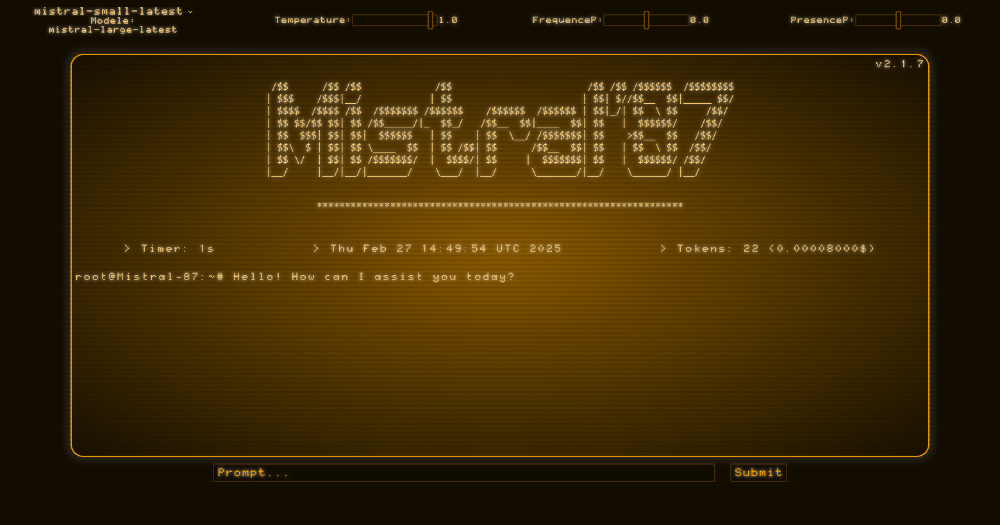

# Chatbot MistralAI avec Flask

Ce code est un chatbot qui utilise le modèle mistral-large-latest de MistralAI pour générer des réponses à partir des entrées de l'utilisateur. Le chatbot est créé à l'aide du framework Flask pour Python.

## Installation

Pour installer les dépendances, exécutez la commande suivante :

"""pip install -r requirements.txt"""

Il est également nécessaire d'avoir une clé d'API MistralAI valide pour utiliser le modèle mistral-large-latest.

## Utilisation

Pour lancer le chatbot, exécutez le fichier `app.py` en utilisant la commande :

"""python app.py"""

Le chatbot est alors accessible à l'adresse `http://localhost:5000` dans un navigateur web. Les utilisateurs peuvent saisir des messages dans la zone de texte et appuyer sur le bouton "Envoyer" pour envoyer le message au chatbot. Le chatbot répondra alors avec une réponse générée par le modèle mistral-large-latest.

## Fonctionnement

Le chatbot utilise la bibliothèque Flask pour créer une application web. L'interface utilisateur est définie dans le fichier `chat.html`, qui utilise le moteur de template Jinja2 pour afficher les messages. Les messages sont stockés dans une liste `messages`, qui est passée au template lorsqu'il est rendu. Les messages sont affichés sous forme de liste non ordonnée (`<ul>`) avec chaque message sous forme de liste (`<li>`). Le nom de l'expéditeur est affiché en premier, suivi du contenu du message. Le formulaire de saisie de texte utilise la méthode POST pour envoyer les messages au chatbot.

Le modèle mistral-large-latest de MistralAI est utilisé pour générer des réponses aux messages de l'utilisateur. La fonction `generate_response` envoie le message de l'utilisateur au modèle mistral-large-latest en utilisant l'API MistralAI. Le modèle génère une réponse qui est renvoyée au chatbot. La réponse est ensuite stockée dans la liste `messages` et affichée dans l'interface utilisateur.
